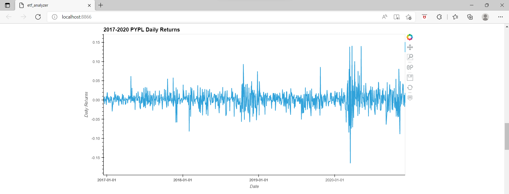

# Project Title

The etf analyzer application is a python jupyter lab interface program.  It queries SQL data via sqlite database connection, prepares data as Pandas Dataframe, and creates interactive line plot.  The user can analyze ETF portfolio in consolidation by daily return average, annualized return, and cumulative return.

---

## Technologies

This project leverages python 3.7 with the following packages:

* [Jupyter Notebook](https://jupyter-notebook-beginner-guide.readthedocs.io/en/latest/what_is_jupyter.html) - It's a server-client application that allows editing and running notebook documents via a web browser.

* [pandas](https://pandas.pydata.org/pandas-docs/stable/index.html) - For Series, DataFrame, and plots

* [numpy](https://numpy.org/) - For working with arrays, domain of linear algebra, fourier transform, and matrices.

* [hvplot](https://hvplot.holoviz.org/user_guide/Introduction.html) - For a high-level plotting API built on HoloViews and Bokeh that provides a general and consistent API for plotting data in all the abovementioned formats.

* [sqlalchemy](https://www.sqlalchemy.org/) - For Python SQL toolkit and Object Relational Mapper that gives application developers the full power and flexibility of SQL.

* [bokeh.models](https://docs.bokeh.org/en/latest/docs/reference/models.html) - For Plot formatting.

This user can use the Voilà library to deploy the notebook as a web application

* [voila](https://pypi.org/project/voila/) - For turning Jupyter notebooks into standalone web applications.


## Installation Guide

Before running the application first install the following dependencies.

```python
  pip install pandas
  pip install jupyterlab
  pip install SQLAlchemy
```

```conda
  conda install -c conda-forge voila
```

## Usage

To use the loan qualifier app, simply clone the `ETF_Analyzer' from the respository, open jupyter lab and open **etf_analyzer.ipynb** with:

```python
jupyter lab
```

Upon launching the etf_analyzer in jupyter notebook, you will have cells to input the `database_connection_string`, then enter the sqlite temporary connection and the `eft.db` name.

After inputs, then re-run the jupyter book to produce ETF daily returns, annualized returns, cumulative returns and its interactive line charts.

See below for rerun jupter lab.


To publish the **etf_analyzer.ipynb** on the local web applications, go to the terminal and enter voila comment following with jupyter lab notebook file path.

See below for voila comment line in terminal.


See below for interactive line chart example.


---

## Contributors

Brought to you by FinTech Material and Eunice

---

## License

MIT